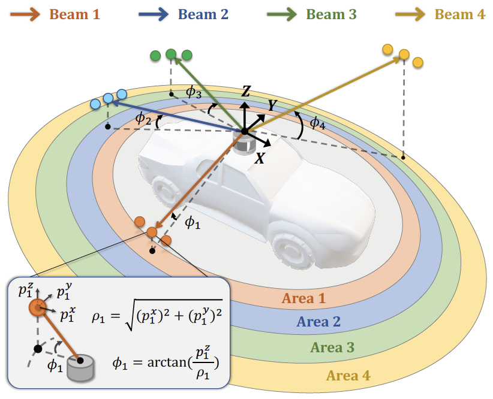
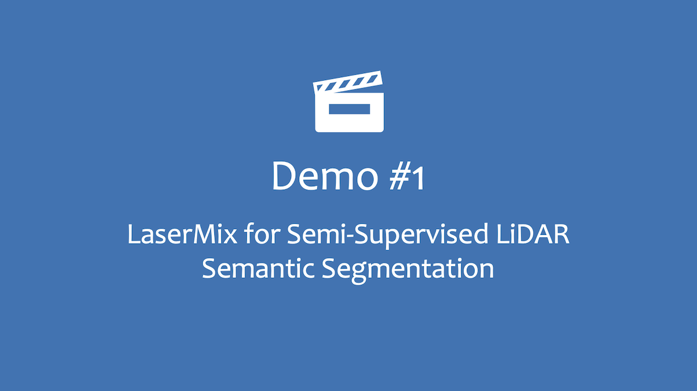
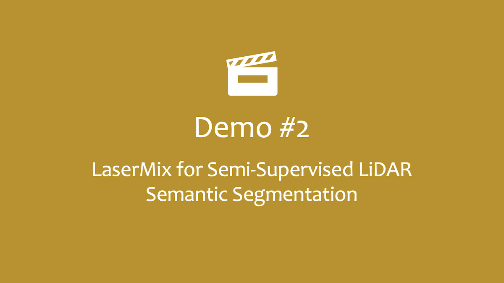
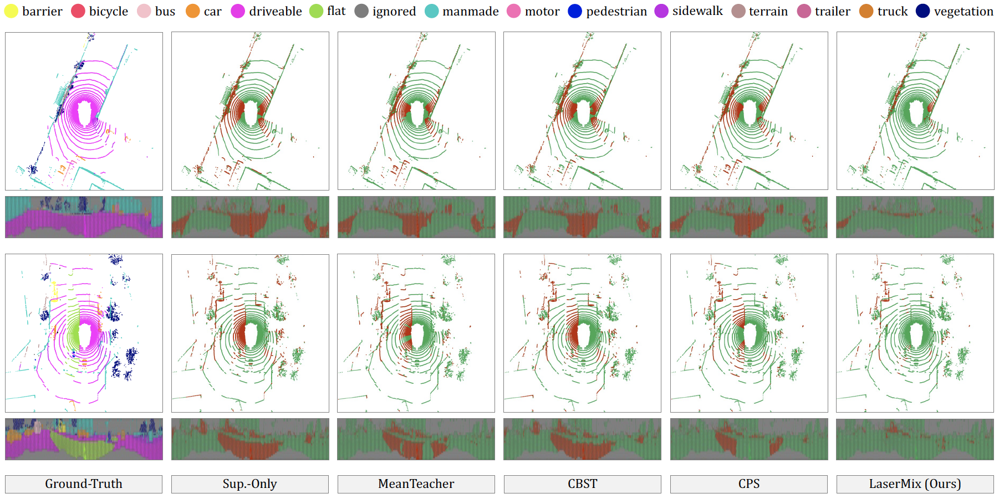

<br />
<p align="center">
  

  
  <h3 align="center"><strong>LaserMix for Semi-Supervised LiDAR Semantic Segmentation</strong></h3>
  
  <p align="center">
      <a href="https://scholar.google.com/citations?user=-j1j7TkAAAAJ" target='_blank'>Lingdong Kong</a>,&nbsp;
      <a href="https://scholar.google.com/citations?user=YUKPVCoAAAAJ" target='_blank'>Jiawei Ren</a>,&nbsp;
      <a href="https://scholar.google.com/citations?user=lSDISOcAAAAJ" target='_blank'>Liang Pan</a>,&nbsp;
      <a href="https://scholar.google.com/citations?user=lc45xlcAAAAJ" target='_blank'>Ziwei Liu</a>
    <br>
  S-Lab, Nanyang Technological University
  </p>
</p>

<p align="center">
  <a href="https://arxiv.org/abs/2207.00026" target='_blank'>
    
  </a>
  
  <a href="https://ldkong.com/LaserMix" target='_blank'>
    
  </a>
  
  <a href="https://youtu.be/Xkwa5-dT0g4" target='_blank'>
    
  </a>
  
  <a href="" target='_blank'>
    
  </a>
  
  <a href="https://zhuanlan.zhihu.com/p/528689803" target='_blank'>
    
  </a>
  
  <a href="" target='_blank'>
    
  </a>
  
</p>

## About

<strong>LaserMix</strong> is a semi-supervised learning (SSL) framework designed for LiDAR semantic segmentation. It leverages the strong <strong>spatial prior</strong> of driving scenes to construct <strong>low-variation areas</strong> via <strong>laser beam mixing</strong>, and encourages segmentation models to make <strong>confident</strong> and <strong>consistent</strong> predictions before and after mixing.

<br>
<p align="center">
  
  <br>
  Fig. Illustration for laser beam partition based on inclination &phi;.
</p>
<br>

Visit our <a href="https://ldkong.com/LaserMix" target='_blank'>project page</a> to explore more details. :red_car:


## Updates

- \[2024.05\] - Our improved framework, [LaserMix++](https://arxiv.org/abs/2405.05258) :rocket:, is avaliable on arXiv.
- \[2024.01\] - The [toolkit](https://github.com/robodrive-24/toolkit) tailored for [The RoboDrive Challenge](https://robodrive-24.github.io/) has been released. :hammer_and_wrench:
- \[2023.12\] - We are hosting [The RoboDrive Challenge](https://robodrive-24.github.io/) at [ICRA 2024](https://2024.ieee-icra.org/). :blue_car:
- \[2023.12\] - Introducing [FRNet](https://github.com/Xiangxu-0103/FRNet), an efficient and effective **real-time** LiDAR segmentation model that achieves promising semi-supervised learning results on `SemanticKITTI` and `nuScenes`. Code and checkpoints are available for downloading.
- \[2023.03\] - Intend to test the **robustness** of your LiDAR semantic segmentation models? Check our recent work, :robot: [Robo3D](https://github.com/ldkong1205/Robo3D), a comprehensive suite that enables OoD robustness evaluation of 3D segmentors on our newly established datasets: `SemanticKITTI-C`, `nuScenes-C`, and `WOD-C`.
- \[2023.03\] - LaserMix was selected as a :sparkles: highlight :sparkles: at [CVPR 2023](https://cvpr.thecvf.com/) (top 10% of accepted papers).
- \[2023.02\] - LaserMix was accepted to [CVPR 2023](https://cvpr.thecvf.com/)! :tada:
- \[2023.02\] - LaserMix has been integrated into the [MMDetection3D](https://github.com/open-mmlab/mmdetection3d) codebase! Check [this](https://github.com/open-mmlab/mmdetection3d/pull/2302) PR in the `dev-1.x` branch to know more details. :beers:
- \[2023.01\] - As suggested, we will establish a *sequential track* taking into account the LiDAR data collection nature in our semi-supervised LiDAR semantic segmentation benchmark. The results will be gradually updated in [RESULT.md](docs/RESULT.md).
- \[2022.12\] - We support a wider range of LiDAR segmentation backbones, including [RangeNet++](https://www.ipb.uni-bonn.de/wp-content/papercite-data/pdf/milioto2019iros.pdf), [SalsaNext](https://arxiv.org/abs/2003.03653), [FIDNet](https://arxiv.org/abs/2109.03787), [CENet](https://arxiv.org/abs/2207.12691), [MinkowskiUNet](https://github.com/NVIDIA/MinkowskiEngine), [Cylinder3D](https://openaccess.thecvf.com/content/CVPR2021/papers/Zhu_Cylindrical_and_Asymmetrical_3D_Convolution_Networks_for_LiDAR_Segmentation_CVPR_2021_paper.pdf), and [SPVCNN](https://arxiv.org/pdf/2007.16100), under both fully- and semi-supervised settings. The checkpoints will be available soon!
- \[2022.12\] - The derivation of spatial-prior-based SSL is available [here](https://ldkong.com/LaserMix/derivation.pdf). Take a look! :memo:
- \[2022.08\] - LaserMix achieves 1st place among the semi-supervised semantic segmentation leaderboards of [nuScenes](https://paperswithcode.com/sota/semi-supervised-semantic-segmentation-on-25), [SemanticKITTI](https://paperswithcode.com/sota/semi-supervised-semantic-segmentation-on-24), and [ScribbleKITTI](https://paperswithcode.com/sota/semi-supervised-semantic-segmentation-on-23), based on [Paper-with-Code](https://paperswithcode.com/paper/lasermix-for-semi-supervised-lidar-semantic). :bar_chart:
- \[2022.08\] - We provide a [video demo](https://youtu.be/Xkwa5-dT0g4) for visual comparisons on the SemanticKITTI val set. Take a look!
- \[2022.07\] - Our paper is available on arXiv, click <a href="https://arxiv.org/abs/2207.00026" target='_blank'>here</a> to check it out. Code will be available soon!


## Outline

- [Installation](#installation)
- [Data Preparation](#data-preparation)
- [Getting Started](#getting-started)
- [Video Demo](#video-demo)
- [Main Results](#main-results)
- [TODO List](#todo-list)
- [License](#license)
- [Acknowledgement](#acknowledgement)
- [Citation](#citation)

## Installation
Please refer to [INSTALL.md](docs/INSTALL.md) for the installation details.


## Data Preparation
Please refer to [DATA_PREPARE.md](docs/DATA_PREPARE.md) for the details to prepare the <sup>1</sup>[nuScenes](https://www.nuscenes.org), <sup>2</sup>[SemanticKITTI](http://www.semantic-kitti.org/), and <sup>3</sup>[ScribbleKITTI](https://github.com/ouenal/scribblekitti) datasets.


## Getting Started
Please refer to [GET_STARTED.md](docs/GET_STARTED.md) to learn more usage about this codebase.


## Video Demo
| Demo 1 | Demo 2| Demo 3 | 
| :-: | :-: | :-: |
|  |   |   | 
| [Link](https://youtu.be/Xkwa5-dT0g4) <sup>:arrow_heading_up:</sup> | [Link](https://youtu.be/OlKNDt8_um4) <sup>:arrow_heading_up:</sup> | [Link](https://youtu.be/f8UKgxi5mow) <sup>:arrow_heading_up:</sup> |


## Main Result
### Framework Overview

<p align="center">
  
</p>


### Range View

<table>
   <tr>
      <th rowspan="2">Method</th>
      <th colspan="4">nuScenes</th>
      <th colspan="4">SemanticKITTI</th>
      <th colspan="4">ScribbleKITTI</th>
   </tr>
   <tr>
      <td>1%</td> <td>10%</td> <td>20%</td> <td>50%</td>
      <td>1%</td> <td>10%</td> <td>20%</td> <td>50%</td>
      <td>1%</td> <td>10%</td> <td>20%</td> <td>50%</td>
   </tr>
   <tr>
      <td>Sup.-only</td>
      <td>38.3</td> <td>57.5</td> <td>62.7</td> <td>67.6</td>
      <td>36.2</td> <td>52.2</td> <td>55.9</td> <td>57.2</td>
      <td>33.1</td> <td>47.7</td> <td>49.9</td> <td>52.5</td>
   </tr>
   <tr>
      <td><strong>LaserMix</strong></td>
      <td>49.5</td><td>68.2</td><td>70.6</td><td>73.0</td>
      <td>43.4</td><td>58.8</td><td>59.4</td><td>61.4</td>
      <td>38.3</td><td>54.4</td><td>55.6</td><td>58.7</td>
   </tr>
  <tr>
      <td><i>improv.</i> &#8593</td>
      <td><sup>+</sup>11.2</td> <td><sup>+</sup>10.7</td> <td><sup>+</sup>7.9</td> <td><sup>+</sup>5.4</td>
      <td><sup>+</sup>7.2</td>  <td><sup>+</sup>6.6</td>  <td><sup>+</sup>3.5</td> <td><sup>+</sup>4.2</td>
      <td><sup>+</sup>5.2</td>  <td><sup>+</sup>6.7</td>  <td><sup>+</sup>5.7</td> <td><sup>+</sup>6.2</td>
   </tr>
   <tr>
      <td><strong>LaserMix++</strong></td>
      <td> </td> <td> </td> <td> </td> <td> </td>
      <td> </td> <td> </td> <td> </td> <td> </td>
      <td> </td> <td> </td> <td> </td> <td> </td>
   </tr>
   <tr>
      <td><i>improv.</i> &#8593</td>
      <td> </td> <td> </td> <td> </td> <td> </td>
      <td> </td> <td> </td> <td> </td> <td> </td>
      <td> </td> <td> </td> <td> </td> <td> </td>
   </tr>
</table>

### Voxel

<table>
   <tr>
      <th rowspan="2">Method</th>
      <th colspan="4">nuScenes</th>
      <th colspan="4">SemanticKITTI</th>
      <th colspan="4">ScribbleKITTI</th>
   </tr>
   <tr>
      <td>1%</td> <td>10%</td> <td>20%</td> <td>50%</td>
      <td>1%</td> <td>10%</td> <td>20%</td> <td>50%</td>
      <td>1%</td> <td>10%</td> <td>20%</td> <td>50%</td>
   </tr>
   <tr>
      <td>Sup.-only</td>
      <td>50.9</td> <td>65.9</td> <td>66.6</td> <td>71.2</td>
      <td>45.4</td> <td>56.1</td> <td>57.8</td> <td>58.7</td>
      <td>39.2</td> <td>48.0</td> <td>52.1</td> <td>53.8</td>
   </tr>
   <tr>
      <td><strong>LaserMix</strong></td>
      <td>55.3</td> <td>69.9</td> <td>71.8</td> <td>73.2</td>
      <td>50.6</td> <td>60.0</td> <td>61.9</td> <td>62.3</td>
      <td>44.2</td> <td>53.7</td> <td>55.1</td> <td>56.8</td>
   </tr>
   <tr>
      <td><i>improv.</i> &#8593</td>
      <td><sup>+</sup><small>4.4</small></td> <td><sup>+</sup><small>4.0</small></td> <td><sup>+</sup><small>5.2</small></td> <td><sup>+</sup><small>2.0</small></td>
      <td><sup>+</sup><small>5.2</small></td> <td><sup>+</sup><small>3.9</small></td> <td><sup>+</sup><small>4.1</small></td> <td><sup>+</sup><small>3.6</small></td>
      <td><sup>+</sup><small>5.0</small></td> <td><sup>+</sup><small>5.7</small></td> <td><sup>+</sup><small>3.0</small></td> <td><sup>+</sup><small>3.0</small></td>
   </tr>
   <tr>
      <td><strong>LaserMix++</strong></td>
      <td> </td> <td> </td> <td> </td> <td> </td>
      <td> </td> <td> </td> <td> </td> <td> </td>
      <td> </td> <td> </td> <td> </td> <td> </td>
   </tr>
   <tr>
      <td><i>improv.</i> &#8593</td>
      <td> </td> <td> </td> <td> </td> <td> </td>
      <td> </td> <td> </td> <td> </td> <td> </td>
      <td> </td> <td> </td> <td> </td> <td> </td>
   </tr>
</table>

### Ablation Studies

<p align="center">
  
</p>

### Qualitative Examples



### Checkpoints & More Results

For more experimental results and pretrained weights, please refer to [RESULT.md](docs/RESULT.md).


## TODO List

- [x] Initial release. :rocket:
- [x] Add license. See [here](#license) for more details.
- [x] Add video demos :movie_camera:
- [x] Add installation details.
- [x] Add data preparation details.
- [ ] Add evaluation details.
- [ ] Add training details.


## Citation

If you find this work helpful, please kindly consider citing our paper:

```bibtex
@inproceedings{kong2023lasermix,
  title = {LaserMix for Semi-Supervised LiDAR Semantic Segmentation},
  author = {Kong, Lingdong and Ren, Jiawei and Pan, Liang and Liu, Ziwei},
  booktitle = {IEEE/CVF Conference on Computer Vision and Pattern Recognition},
  pages = {21705--21715},
  year = {2023},
}
```


## License
<a rel="license" href="http://creativecommons.org/licenses/by-nc-sa/4.0/"></a>
<br />
This work is under the <a rel="license" href="http://creativecommons.org/licenses/by-nc-sa/4.0/">Creative Commons Attribution-NonCommercial-ShareAlike 4.0 International License</a>.


## Acknowledgement
This work is developed based on the [MMDetection3D](https://github.com/open-mmlab/mmdetection3d) codebase.

><br>
> MMDetection3D is an open-source toolbox based on PyTorch, towards the next-generation platform for general 3D perception. It is a part of the OpenMMLab project developed by MMLab.

We acknowledge the use of the following public resources during the course of this work: <sup>1</sup>[nuScenes](https://www.nuscenes.org), <sup>2</sup>[nuScenes-devkit](https://github.com/nutonomy/nuscenes-devkit), <sup>3</sup>[SemanticKITTI](http://www.semantic-kitti.org/), <sup>4</sup>[SemanticKITTI-API](https://github.com/PRBonn/semantic-kitti-api), <sup>5</sup>[ScribbleKITTI](https://github.com/ouenal/scribblekitti), <sup>6</sup>[FIDNet](https://github.com/placeforyiming/IROS21-FIDNet-SemanticKITTI), <sup>7</sup>[CENet](https://github.com/huixiancheng/CENet), <sup>8</sup>[SPVNAS](https://github.com/mit-han-lab/spvnas), <sup>9</sup>[Cylinder3D](https://github.com/xinge008/Cylinder3D), <sup>10</sup>[TorchSemiSeg](https://github.com/charlesCXK/TorchSemiSeg), <sup>11</sup>[MixUp](https://github.com/facebookresearch/mixup-cifar10), <sup>12</sup>[CutMix](https://github.com/clovaai/CutMix-PyTorch), <sup>13</sup>[CutMix-Seg](https://github.com/Britefury/cutmix-semisup-seg), <sup>14</sup>[CBST](https://github.com/yzou2/CBST), <sup>15</sup>[MeanTeacher](https://github.com/CuriousAI/mean-teacher), and <sup>16</sup>[Cityscapes](https://www.cityscapes-dataset.com).

We would like to thank <a href="https://hongfz16.github.io/" target='_blank'>Fangzhou Hong</a> for the insightful discussions and feedback. ❤️


