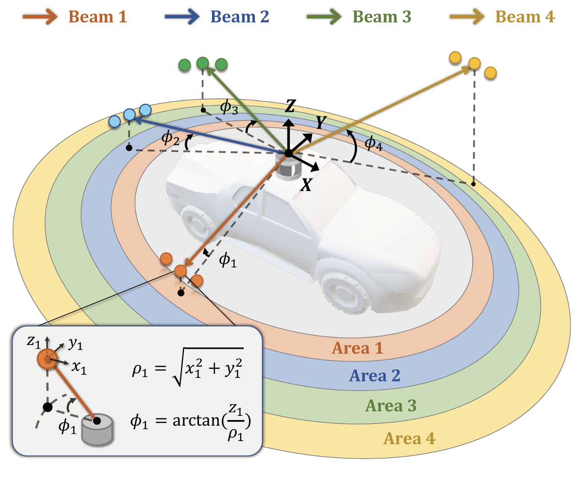
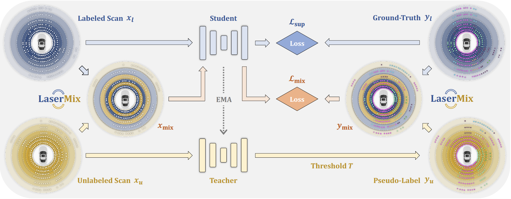
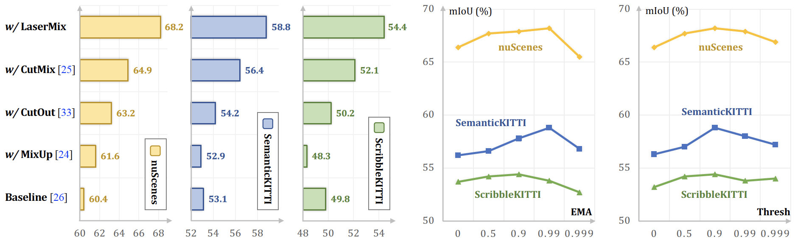

<br />
<p align="center">
  

  
  <h3 align="center"><strong>LaserMix for Semi-Supervised LiDAR Semantic Segmentation</strong></h3>
  
  <p align="center">
      <a href="https://scholar.google.com/citations?user=-j1j7TkAAAAJ" target='_blank'>Lingdong Kong</a>,&nbsp;
      <a href="https://scholar.google.com/citations?user=YUKPVCoAAAAJ" target='_blank'>Jiawei Ren</a>,&nbsp;
      <a href="https://scholar.google.com/citations?user=lSDISOcAAAAJ" target='_blank'>Liang Pan</a>,&nbsp;
      <a href="https://scholar.google.com/citations?user=lc45xlcAAAAJ" target='_blank'>Ziwei Liu</a>
    <br>
  S-Lab, Nanyang Technological University
  </p>
</p>

<p align="center">
  <a href="https://arxiv.org/abs/2207.00026" target='_blank'>
    
  </a>
  
  <a href="https://ldkong.com/LaserMix" target='_blank'>
    
  </a>
  
  <a href="https://zhuanlan.zhihu.com/p/528689803" target='_blank'>
    
  </a>
</p>

## About

<strong>LaserMix</strong> is a semi-supervised learning (SSL) framework designed for LiDAR semantic segmentation. It leverages the strong <strong>spatial prior</strong> of driving scenes to construct <strong>low-variation areas</strong> via <strong>laser beam mixing</strong>, and encourages segmentation models to make <strong>confident</strong> and <strong>consistent</strong> predictions before and after mixing.

<br>
<p align="center">
  
  <br>
  Fig. Illustration for laser beam partition based on inclination &phi;.
</p>
<br>

Visit our <a href="https://ldkong.com/LaserMix" target='_blank'>project page</a> to explore more details. 🚗


## Updates

- \[2022.07.03\] Our paper is available on arXiv, click <a href="https://arxiv.org/abs/2207.00026" target='_blank'>here</a> to check it out. Code will be available soon!


## Outline

- [Installation](#installation)
- [Data Preparation](#data-preparation)
- [Getting Started](#getting-started)
- [Main Results](#main-results)
- [TODO List](#todo-list)
- [License](#license)
- [Acknowledgement](#acknowledgement)
- [Citation](#citation)


## Installation
Please refer to [INSTALL.md](docs/INSTALL.md) for the installation details.


## Data Preparation
Please refer to [DATA_PREPARE.md](docs/DATA_PREPARE.md) for the details to prepare the <sup>1</sup>[nuScenes](https://www.nuscenes.org), <sup>2</sup>[SemanticKITTI](http://www.semantic-kitti.org/), and <sup>3</sup>[ScribbleKITTI](https://github.com/ouenal/scribblekitti) datasets.


## Getting Started
Please refer to [GET_STARTED.md](docs/GET_STARTED.md) to learn more usage about this codebase.


## Main Results
#### Framework Overview

<p align="center">
  
</p>


#### Range View

<table>
   <tr>
      <th rowspan="2">Method</th>
      <th colspan="4">nuScenes</th>
      <th colspan="4">SemanticKITTI</th>
      <th colspan="4">ScribbleKITTI</th>
   </tr>
   <tr>
      <td>1%</td> <td>10%</td> <td>20%</td> <td>50%</td>
      <td>1%</td> <td>10%</td> <td>20%</td> <td>50%</td>
      <td>1%</td> <td>10%</td> <td>20%</td> <td>50%</td>
   </tr>
   <tr>
      <td>Sup.-only</td>
      <td>38.3</td> <td>57.5</td> <td>62.7</td> <td>67.6</td>
      <td>36.2</td> <td>52.2</td> <td>55.9</td> <td>57.2</td>
      <td>33.1</td> <td>47.7</td> <td>49.9</td> <td>52.5</td>
   </tr>
   <tr>
      <td><strong>LaserMix</strong></td>
      <td>49.5</td><td>68.2</td><td>70.6</td><td>73.0</td>
      <td>43.4</td><td>58.8</td><td>59.4</td><td>61.4</td>
      <td>38.3</td><td>54.4</td><td>55.6</td><td>58.7</td>
   </tr>
  <tr>
      <td><i>improv.</i> &#8593</td>
      <td><sup>+</sup>11.2</td> <td><sup>+</sup>10.7</td> <td><sup>+</sup>7.9</td> <td><sup>+</sup>5.4</td>
      <td><sup>+</sup>7.2</td>  <td><sup>+</sup>6.6</td>  <td><sup>+</sup>3.5</td> <td><sup>+</sup>4.2</td>
      <td><sup>+</sup>5.2</td>  <td><sup>+</sup>6.7</td>  <td><sup>+</sup>5.7</td> <td><sup>+</sup>6.2</td>
   </tr>
</table>

#### Voxel

<table>
   <tr>
      <th rowspan="2">Method</th>
      <th colspan="4">nuScenes</th>
      <th colspan="4">SemanticKITTI</th>
      <th colspan="4">ScribbleKITTI</th>
   </tr>
   <tr>
      <td>1%</td> <td>10%</td> <td>20%</td> <td>50%</td>
      <td>1%</td> <td>10%</td> <td>20%</td> <td>50%</td>
      <td>1%</td> <td>10%</td> <td>20%</td> <td>50%</td>
   </tr>
   <tr>
      <td>Sup.-only</td>
      <td>50.9</td> <td>65.9</td> <td>66.6</td> <td>71.2</td>
      <td>45.4</td> <td>56.1</td> <td>57.8</td> <td>58.7</td>
      <td>39.2</td> <td>48.0</td> <td>52.1</td> <td>53.8</td>
   </tr>
   <tr>
      <td><strong>LaserMix</strong></td>
      <td>55.3</td> <td>69.9</td> <td>71.8</td> <td>73.2</td>
      <td>50.6</td> <td>60.0</td> <td>61.9</td> <td>62.3</td>
      <td>44.2</td> <td>53.7</td> <td>55.1</td> <td>56.8</td>
   </tr>
   <tr>
      <td><i>improv.</i> &#8593</td>
      <td><sup>+</sup><small>4.4</small></td> <td><sup>+</sup><small>4.0</small></td> <td><sup>+</sup><small>5.2</small></td> <td><sup>+</sup><small>2.0</small></td>
      <td><sup>+</sup><small>5.2</small></td> <td><sup>+</sup><small>3.9</small></td> <td><sup>+</sup><small>4.1</small></td> <td><sup>+</sup><small>3.6</small></td>
      <td><sup>+</sup><small>5.0</small></td> <td><sup>+</sup><small>5.7</small></td> <td><sup>+</sup><small>3.0</small></td> <td><sup>+</sup><small>3.0</small></td>
   </tr>
</table>

#### Ablation Studies

<p align="center">
  
</p>

#### Qualitative Examples


## TODO List

- [x] Initial release. 🚀
- [x] Add license. See [here](#license) for more details.
- [ ] Add installation details.
- [ ] Add data preparation details.
- [ ] Add evaluation details.
- [ ] Add training details.


## License
<a rel="license" href="http://creativecommons.org/licenses/by-nc-sa/4.0/"></a>
<br />
This work is under the <a rel="license" href="http://creativecommons.org/licenses/by-nc-sa/4.0/">Creative Commons Attribution-NonCommercial-ShareAlike 4.0 International License</a>.


## Acknowledgement
We acknowledge the use of the following public resources during the course of this work: <sup>1</sup>[nuScenes](https://www.nuscenes.org), <sup>2</sup>[nuScenes-devkit](https://github.com/nutonomy/nuscenes-devkit), <sup>3</sup>[SemanticKITTI](http://www.semantic-kitti.org/), <sup>4</sup>[SemanticKITTI-API](https://github.com/PRBonn/semantic-kitti-api), <sup>5</sup>[ScribbleKITTI](https://github.com/ouenal/scribblekitti), <sup>6</sup>[FIDNet](https://github.com/placeforyiming/IROS21-FIDNet-SemanticKITTI), <sup>7</sup>[Cylinder3D](https://github.com/xinge008/Cylinder3D), <sup>8</sup>[TorchSemiSeg](https://github.com/charlesCXK/TorchSemiSeg), <sup>9</sup>[MixUp](https://github.com/facebookresearch/mixup-cifar10), <sup>10</sup>[CutMix](https://github.com/clovaai/CutMix-PyTorch), <sup>11</sup>[CutMix-Seg](https://github.com/Britefury/cutmix-semisup-seg), <sup>12</sup>[CBST](https://github.com/yzou2/CBST), <sup>13</sup>[MeanTeacher](https://github.com/CuriousAI/mean-teacher), and <sup>14</sup>[Cityscapes](https://www.cityscapes-dataset.com).

We would like to thank <a href="https://hongfz16.github.io/" target='_blank'>Fangzhou Hong</a> for the insightful discussions and feedback. ❤️


## Citation

If you find this work helpful, please kindly consider citing our paper:

```bibtex
@ARTICLE{kong2022lasermix,
  title={LaserMix for Semi-Supervised LiDAR Semantic Segmentation},
  author={Kong, Lingdong and Ren, Jiawei and Pan, Liang and Liu, Ziwei},
  journal={arXiv preprint arXiv:2207.00026}, 
  year={2022},
}
```

